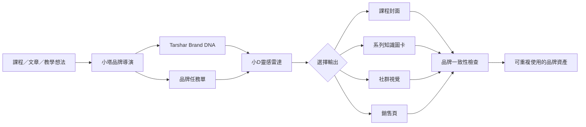
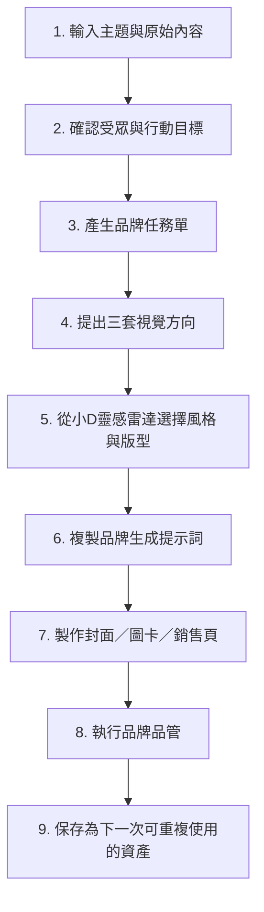
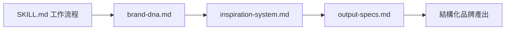
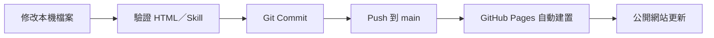

<div align="center">


# Tarshar Brand Studio

### 小塔品牌導演 × 小D靈感雷達

把課程、文章與教學想法，轉成可持續使用的品牌視覺系統。

[](https://tarshar4242.github.io/tarshar-brand-studio/)


**[立即開啟線上版](https://tarshar4242.github.io/tarshar-brand-studio/)** · **[查看小塔 Skill](skills/tarshar-brand-director/SKILL.md)**

</div>

---

## 專案定位

Tarshar Brand Studio 不是單次生圖工具，而是一套為 **Learn AI with Tarshar** 建立的品牌視覺作業系統。

它把品牌製作拆成兩個合作角色：

| 角色 | 定位 | 主要任務 | 產出 |
|---|---|---|---|
| **小塔品牌導演** | 品牌策略與品質總監 | 理解內容、受眾與行動目標，建立一致的視覺任務 | 品牌任務單、視覺方向、品管規格 |
| **小D靈感雷達** | Design DNA 靈感策展人 | 從 100 組設計方向中篩選適合的風格與版型 | 靈感組合、收藏清單、生成提示詞 |

### 核心承諾

> 不只是替你生一張圖，而是替你建立一套能反覆產出封面、圖卡與銷售頁的品牌能力。

---

## 為什麼需要這套系統

傳統外包通常只能取得一次成果；Brand Studio 保存的是可持續累積的品牌決策。

| 常見問題 | Brand Studio 的處理方式 |
|---|---|
| 每次作品風格不同，看不出是同一個品牌 | 使用固定 Brand DNA、色彩、語氣、版面與署名規則 |
| 收藏很多圖片，實際製作時仍不知道怎麼選 | 將靈感拆成「風格 × 版型 × 使用情境」 |
| AI 圖片漂亮，但與課程訊息沒有關係 | 先產生品牌任務單，再決定視覺方向 |
| 一張圖塞太多內容，手機閱讀困難 | 一張只傳達一個主要訊息，內容過多時先拆卡 |
| 每次重新撰寫生成提示詞 | 每組靈感都提供可直接複製的品牌提示詞 |

---

## 系統架構



### 完整工作流程



---

## 核心功能

### 1. 小塔品牌導演

使用者填入四項資訊，即可產生結構化品牌任務單：

| 欄位 | 說明 | 範例 |
|---|---|---|
| 主題 | 本次作品的核心題目 | 完全不懂 AI 的第一堂課 |
| 對象 | 最主要的閱讀者 | 台灣零基礎成人學習者 |
| 輸出 | 希望製作的成果 | 課程封面、10 張圖卡、銷售頁 |
| 感受 | 希望讀者感受到的品牌情緒 | 溫暖、清楚、可信任 |
| 原始內容 | 文章、課綱、筆記或想法 | 課程介紹與三項學習成果 |

產出的任務單包含：品牌色彩、教學語氣、閱讀規則、固定署名與視覺方向提案要求。

### 2. 小D靈感雷達

靈感庫採用 **10 種風格 × 10 種版型**，形成 100 組可執行設計方向。

#### 十種風格

| 風格 | 情緒 | 適合情境 |
|---|---|---|
| 溫暖教學 | 安心、清楚 | 零基礎課程與教學圖卡 |
| 日系手帳 | 親切、生活感 | 學習筆記與反思內容 |
| 自然療癒 | 沉靜、陪伴 | 成長、情緒與生活主題 |
| 清新雜誌 | 俐落、有品味 | 專題封面與品牌文章 |
| 親和扁平 | 好懂、活潑 | 工具教學與步驟說明 |
| 紙感拼貼 | 創意、有溫度 | 故事、回顧與個人品牌 |
| 柔和科技 | 新穎、不冰冷 | AI、數位工具與科技課程 |
| 極簡專業 | 可靠、聚焦 | 顧問內容與專業簡報 |
| 故事插畫 | 有共鳴、好記 | 案例、人物與情境敘事 |
| 明亮行動 | 積極、有動力 | 招生、活動與 CTA |

#### 十種版型

`主視覺` · `單句觀念` · `三步驟` · `前後對比` · `九宮摘要` · `重點清單` · `流程圖` · `人物故事` · `課程模組` · `行動召喚`

### 3. 收藏與提示詞

- 使用風格、版型與收藏狀態篩選 100 組靈感。
- 一鍵收藏常用設計方向。
- 一鍵複製包含品牌規格的生成提示詞。
- 自動加入品牌色、目標受眾、手機可讀與風格安全限制。

---

## 快速開始

### 線上使用

不需要安裝任何軟體，直接開啟：

> <https://tarshar4242.github.io/tarshar-brand-studio/>

1. 在「小塔品牌導演」填入主題與內容。
2. 按下「產生品牌任務單」。
3. 複製任務單，交給 AI 或設計師。
4. 到「小D靈感雷達」篩選方向。
5. 收藏合適組合並複製提示詞。

### 本機使用

```bash
git clone https://github.com/tarshar4242/tarshar-brand-studio.git
cd tarshar-brand-studio
open index.html
```

這是單檔靜態網站，不需要安裝套件，也沒有建置步驟。

---

## 使用 Codex Skill

專案同時包含可重複使用的 `tarshar-brand-director` Skill。

### 呼叫範例

```text
使用 $tarshar-brand-director，將這份課程內容規劃成一張封面與十張系列知識圖卡。
```

```text
使用 $tarshar-brand-director，先提出三套適合零基礎成人的品牌視覺方向，不要直接生圖。
```

Skill 會依序讀取：



---

## 專案結構

```text
tarshar-brand-studio/
├── .nojekyll                          # GitHub Pages 靜態網站設定
├── README.md                          # 專案完整說明
├── index.html                         # 單檔互動網站
├── assets/
│   └── readme-banner.svg              # README 品牌封面
└── skills/
    └── tarshar-brand-director/
        ├── SKILL.md                    # Agent 核心工作流程
        ├── agents/
        │   └── openai.yaml             # Codex 顯示名稱與預設提示
        └── references/
            ├── brand-dna.md            # 品牌定位、語氣與視覺規則
            ├── inspiration-system.md   # 小D靈感分類與推薦規則
            └── output-specs.md         # 封面、圖卡與銷售頁規格
```

---

## 技術設計

| 項目 | 使用方式 | 原因 |
|---|---|---|
| 前端 | HTML、CSS、原生 JavaScript | 不需安裝與建置，容易攜帶與教學 |
| 資料 | JavaScript 內建 10×10 組合矩陣 | 立即產生 100 組方向，避免維護重複資料 |
| 個人設定 | `localStorage` | 不需要伺服器，保留收藏與最近任務單 |
| 部署 | GitHub Pages | 免費、穩定、可直接分享網址 |
| Agent | Codex Skill | 將品牌流程、規格與參考資料模組化 |

### 資料與隱私

- 網站沒有帳號系統。
- 不會把使用者輸入傳送到伺服器。
- 任務單與收藏只保存在目前瀏覽器的 `localStorage`。
- 清除瀏覽器網站資料後，本機收藏也會消失。
- 網站不包含第三方分析追蹤程式。

---

## Tarshar Brand DNA v0.1

| 品牌元素 | 規格 |
|---|---|
| 品牌使命 | 把複雜 AI 講到完全沒基礎的人也能理解並立刻使用 |
| 核心受眾 | 台灣零基礎成人學習者、手機優先使用者 |
| 品牌個性 | 溫暖、清楚、務實、陪伴感、可信任 |
| 主色 | 幸運草綠 `#2F8F62` |
| 輔色 | 天空藍 `#4C9ED9` |
| 暖底 | 奶油白 `#FFF9EE` |
| 強調色 | 暖橘 `#F29A4A` |
| 文字色 | 深墨綠 `#173C32` |
| 教學順序 | 生活比喻 → 白話解釋 → 正式定義 → 操作步驟 → 檢查點 |
| 固定署名 | `🍀Learn AI with Tarshar ｜2026` |

### 品牌品管清單

- [ ] 零基礎讀者能在三秒內看懂主題。
- [ ] 一張圖只保留一個主要訊息。
- [ ] 專有名詞先白話、後正式名稱。
- [ ] 手機尺寸下文字仍然清楚可讀。
- [ ] 系列作品使用一致色彩、字體層級、插畫筆觸與邊距。
- [ ] 知識圖卡包含精確品牌署名。
- [ ] 沒有複製其他品牌、創作者或參考作品的獨特元素。

---

## 輸出規格

| 輸出 | 預設尺寸 | 內容原則 |
|---|---|---|
| 網站課程封面 | 1600 × 900 | 縮圖下仍能辨識主題，主標 12–20 字 |
| 社群分享圖片 | 1200 × 630 | 適合連結預覽與橫式社群貼文 |
| Instagram 直式圖卡 | 1080 × 1350 | 手機閱讀優先，保留固定署名區 |
| 方形圖卡 | 1080 × 1080 | 適合摘要、九宮與單句觀念 |
| 銷售頁 | 響應式 | 先做手機版閱讀任務，再擴充桌面版 |

---

## 部署與更新

網站由 GitHub Pages 直接發布 `main` 分支根目錄。



| 設定 | 目前值 |
|---|---|
| Repository | `tarshar4242/tarshar-brand-studio` |
| Default branch | `main` |
| Pages source | `main` / `/` |
| HTTPS | 強制啟用 |
| 網站 | <https://tarshar4242.github.io/tarshar-brand-studio/> |

---

## 已知限制

- 第一版尚未串接圖片生成 API；目前輸出品牌任務單與提示詞。
- 收藏與任務單只存在單一瀏覽器，尚未提供跨裝置同步。
- Brand DNA 是 v0.1，仍需以最終 Logo、授權字體與正式色票校準。
- 100 組靈感是設計決策矩陣，不是受版權保護作品的圖庫。
- 專案目前未附開源授權檔；未經許可請勿將品牌內容用於其他品牌。

---

## 發展路線

- [x] 品牌任務單產生器
- [x] 10 種風格 × 10 種版型
- [x] 靈感篩選、收藏與提示詞複製
- [x] Tarshar Brand DNA 與 Codex Skill
- [x] GitHub Pages 公開部署
- [ ] 加入實際作品預覽與案例頁
- [ ] 支援品牌專案匯出／匯入
- [ ] 加入封面、圖卡與銷售頁模板
- [ ] 串接圖片生成與品牌一致性檢查
- [ ] 建立可擴充的設計參考資料庫

---

## 常見問題

<details>
<summary><strong>這個網站會把我輸入的內容上傳嗎？</strong></summary>

不會。網站是純前端工具，內容只保存在目前瀏覽器。

</details>

<details>
<summary><strong>100 組靈感是否等於 100 張參考圖片？</strong></summary>

不是。它是 10 種風格與 10 種版型交叉形成的 100 組設計決策，重點是協助選擇與執行，不是複製現有作品。

</details>

<details>
<summary><strong>可以直接用它產生圖片嗎？</strong></summary>

目前版本產生品牌任務單與提示詞；將提示詞交給支援圖片生成的工具即可繼續製作。

</details>

<details>
<summary><strong>如何保持一整套圖卡風格一致？</strong></summary>

先鎖定同一組 Brand DNA、風格、版型規則、人物設定、色彩與署名，再批次製作；不要逐張重新決定風格。

</details>

---

<div align="center">

### 讓品牌視覺成為可以累積的能力

**[開啟 Tarshar Brand Studio](https://tarshar4242.github.io/tarshar-brand-studio/)**

🍀Learn AI with Tarshar ｜2026

</div>
